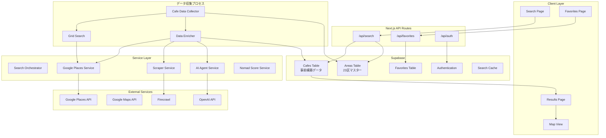
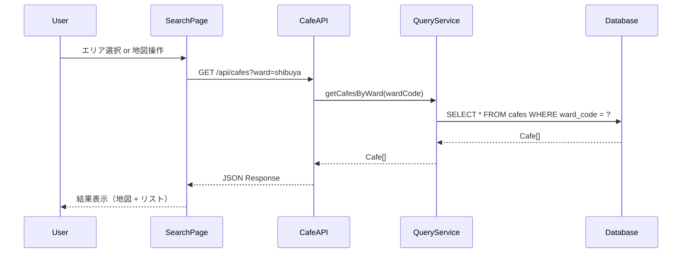
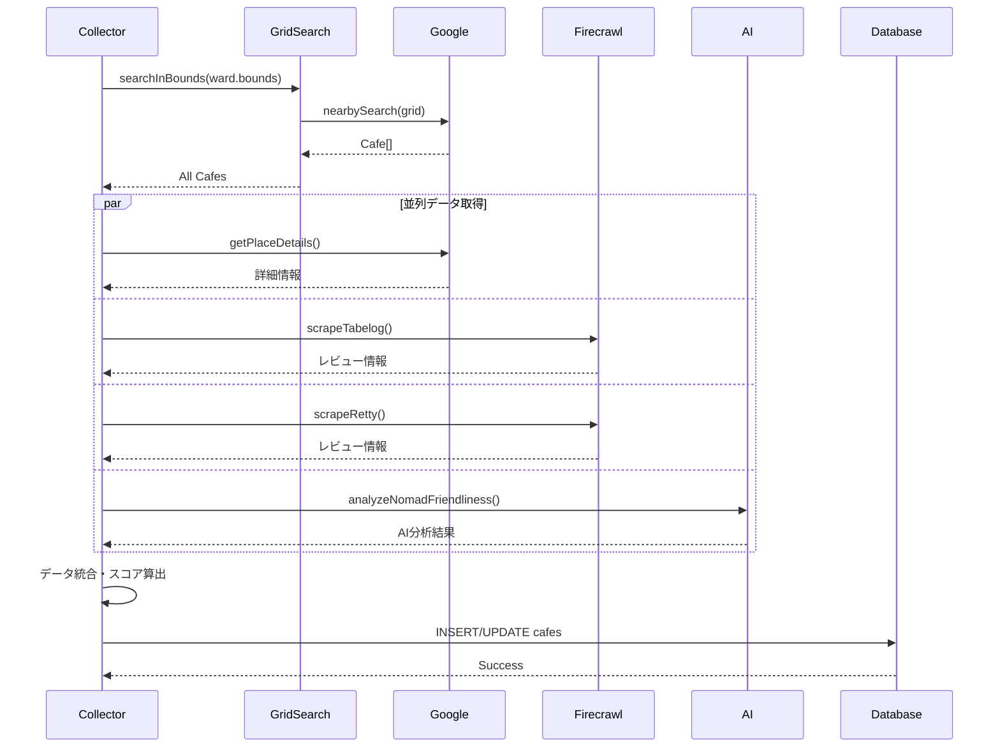
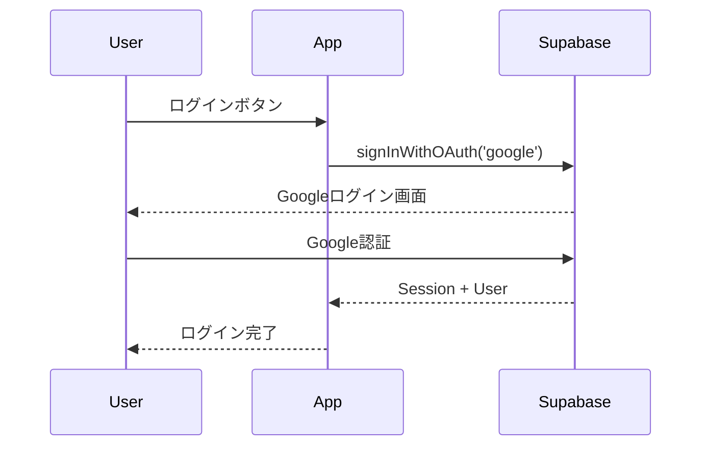

# アーキテクチャ設計

## 全体アーキテクチャ



## レイヤー構成

### 1. Client Layer（フロントエンド）

Next.js App Routerを使用したReact Server Components + Client Components構成。

| ページ | パス | 説明 |
|--------|------|------|
| 検索ページ | `/` | 駅名・場所を入力する検索フォーム |
| 結果ページ | `/results` | 検索結果のカフェ一覧と地図 |
| お気に入り | `/favorites` | 保存したカフェの一覧 |

### 2. API Layer（バックエンド）

Next.js Route Handlersを使用。

| エンドポイント | メソッド | 説明 |
|---------------|----------|------|
| `/api/cafes` | GET | カフェ一覧取得（エリア/地図範囲で検索） |
| `/api/cafes/[id]` | GET | カフェ詳細情報取得 |
| `/api/areas` | GET | エリア（23区）一覧取得 |
| `/api/favorites` | GET/POST/DELETE | お気に入りの操作 |
| `/api/auth/*` | - | Supabase Auth用 |

### 3. Service Layer（ビジネスロジック）

#### Cafe Query Service（新規）
事前構築されたデータベースからカフェ情報を取得する。

```typescript
class CafeQueryService {
  async getCafesByWard(wardCode: string, filters?: CafeFilters): Promise<Cafe[]> {
    const query = this.supabase
      .from('cafes')
      .select('*')
      .eq('ward_code', wardCode)
      .order('nomad_score', { ascending: false });

    if (filters?.minNomadScore) {
      query.gte('nomad_score', filters.minNomadScore);
    }
    if (filters?.hasWifi) {
      query.eq('has_wifi', true);
    }
    if (filters?.hasPowerOutlets) {
      query.eq('has_power_outlets', true);
    }

    const { data, error } = await query;
    return data || [];
  }

  async getCafesByBounds(bounds: Bounds, filters?: CafeFilters): Promise<Cafe[]> {
    const query = this.supabase
      .from('cafes')
      .select('*')
      .gte('lat', bounds.south)
      .lte('lat', bounds.north)
      .gte('lng', bounds.west)
      .lte('lng', bounds.east)
      .order('nomad_score', { ascending: false });

    // フィルター適用（同上）
    
    const { data, error } = await query;
    return data || [];
  }
}
```

#### Cafe Data Collector（データ収集用）
開発段階でデータベースを構築するためのサービス。

```typescript
class CafeDataCollector {
  async collectAllWards() {
    // 全23区のデータを収集
    for (const ward of TOKYO_23_WARDS) {
      await this.collectWard(ward);
    }
  }

  async collectWard(ward: TokyoWard) {
    // 1. グリッド検索でカフェを検出
    const cafes = await this.gridSearch.searchInBounds(ward.bounds);
    
    // 2. 各カフェの詳細情報を並列取得
    const enrichedCafes = await Promise.all(
      cafes.map(cafe => this.enrichCafeData(cafe, ward))
    );
    
    // 3. DBに保存
    await this.saveCafes(enrichedCafes, ward.code);
  }
}
```

#### Google Places Service
Google Places APIを使用してカフェの基本情報を取得。

- Place Search: 指定位置周辺のカフェを検索
- Place Details: 詳細情報（営業時間、写真、レビュー）を取得
- Autocomplete: 場所名の補完候補を提供

#### Scraper Service
Firecrawlを使用して食べログ・Rettyからレビュー情報を取得。

- 検索結果ページから該当店舗を特定
- 店舗ページからレビュー・評価を抽出
- 構造化データとして返却

#### AI Agent Service
OpenAI GPT-4o-miniを使用してノマド向け情報を分析・生成。

- Web検索でWi-Fi・電源情報を収集
- 複数ソースの情報を統合・要約
- 自然言語での説明文を生成

#### Nomad Score Service
収集した情報からノマドスコア（0-100）を算出。

```typescript
interface ScoringCriteria {
  wifi: {
    available: boolean;      // +20
    speed: 'fast' | 'slow';  // +10 / +5
  };
  power: {
    available: boolean;      // +20
    plenty: boolean;         // +10
  };
  noise: 'quiet' | 'moderate' | 'noisy';  // +20 / +10 / 0
  seating: {
    comfortable: boolean;    // +10
    spacious: boolean;       // +10
  };
  stayFriendly: boolean;     // +10 (長居しやすい)
}
```

### 4. External Services

#### Google Maps/Places API
- Maps JavaScript API: 地図表示
- Places API: カフェ検索、詳細情報
- Geocoding API: 駅名→座標変換

#### Firecrawl
- Webページのスクレイピング
- 食べログ、Rettyからのデータ抽出
- 構造化データの抽出

#### OpenAI API
- GPT-4o-mini: コスト効率と性能のバランス
- Function Calling: 構造化出力
- Embeddings（将来）: 類似カフェ検索

#### Supabase
- PostgreSQL: データ永続化
- Auth: ユーザー認証（Google, Email）
- RLS: 行レベルセキュリティ

## データフロー

### 検索フロー（事前構築データベース使用）



### データ収集フロー



### 認証フロー



## エラーハンドリング

### リトライ戦略

- Google Places API: 3回リトライ（exponential backoff）
- Firecrawl: 2回リトライ
- OpenAI: 3回リトライ

### フォールバック

- 食べログ取得失敗 → Rettyのみで続行
- AI分析失敗 → 基本情報のみで表示
- 全データソース失敗 → エラーメッセージ表示

### レート制限

- Google Places: 1000 QPD（無料枠）
- Firecrawl: プランに応じた制限
- OpenAI: TPM/RPM制限

## キャッシュ戦略

### クライアントサイド

- React Query / SWR でAPIレスポンスをキャッシュ
- 同じ検索条件は5分間キャッシュ

### サーバーサイド

- Supabaseに検索結果をキャッシュ
- TTL: 24時間（カフェ情報は頻繁に変わらない）
- キャッシュキー: `${location}_${radius}`

## セキュリティ

### APIキー管理

- サーバーサイドのみで使用（環境変数）
- クライアントに露出しない

### 認証・認可

- Supabase RLSでデータアクセス制御
- お気に入りは本人のみアクセス可能

### レート制限

- API Routesにレート制限を実装
- IP単位で1分間に10リクエストまで

