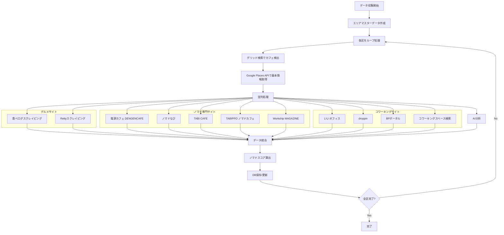

# データ収集戦略

## 概要

本ドキュメントでは、東京23区の全カフェデータを事前にデータベースに構築するための戦略を記載する。

## 目的

- **事前データベース構築**: 開発段階で東京23区の全カフェ情報を収集・保存
- **高速検索**: リアルタイムAPI呼び出しではなく、DBから直接検索
- **データ統合**: 複数のソース（Google Places、食べログ、Retty）から情報を統合
- **UI対応**: 地図UIとエリア選択の両方で閲覧可能

---

## データ収集範囲

### 対象エリア

**東京23区**（特別区）

| 区名 | コード | 面積(km²) | 推定カフェ数 |
|------|--------|-----------|-------------|
| 千代田区 | chiyoda | 11.66 | 約200 |
| 中央区 | chuo | 10.21 | 約300 |
| 港区 | minato | 20.37 | 約500 |
| 新宿区 | shinjuku | 18.23 | 約600 |
| 文京区 | bunkyo | 11.31 | 約300 |
| 台東区 | taito | 10.11 | 約400 |
| 墨田区 | sumida | 13.77 | 約300 |
| 江東区 | koto | 40.16 | 約400 |
| 品川区 | shinagawa | 22.84 | 約500 |
| 目黒区 | meguro | 14.70 | 約400 |
| 大田区 | ota | 60.83 | 約500 |
| 世田谷区 | setagaya | 58.08 | 約800 |
| 渋谷区 | shibuya | 15.11 | 約700 |
| 中野区 | nakano | 15.59 | 約400 |
| 杉並区 | suginami | 34.06 | 約500 |
| 豊島区 | toshima | 13.01 | 約500 |
| 北区 | kita | 20.61 | 約400 |
| 荒川区 | arakawa | 10.20 | 約200 |
| 板橋区 | itabashi | 32.22 | 約400 |
| 練馬区 | nerima | 48.16 | 約500 |
| 足立区 | adachi | 53.25 | 約400 |
| 葛飾区 | katsushika | 34.84 | 約300 |
| 江戸川区 | edogawa | 49.90 | 約400 |

**合計**: 約10,000〜12,000カフェ

---

## データソース

### 1. Google Places API（主要ソース）

**取得情報**:
- 基本情報（名前、住所、座標）
- 営業時間
- 評価・レビュー数
- 価格帯
- 写真
- ウェブサイト・電話番号

**検索方法**:
- **グリッド検索**: 各区を500m×500mのグリッドに分割して検索
- **キーワード**: "カフェ", "coffee", "cafe"
- **タイプ**: `cafe`, `restaurant`（カフェも含む）

**API使用量見積もり**:
- Nearby Search: 約2,000回（23区 × 平均90グリッド）
- Place Details: 約10,000件
- **コスト**: 約$234（初回収集）

### 2. 食べログ（Tabelog）

**取得情報**:
- 評価・レビュー数
- レビュー内容（ノマド関連キーワード抽出）
- 店舗URL

**取得方法**:
- Firecrawlを使用してスクレイピング
- 店舗名 + 住所で検索
- 該当店舗ページから情報抽出

**見積もり**:
- スクレイピング: 約10,000件
- Firecrawl Credits: 約10,000 credits

### 3. Retty

**取得情報**:
- 評価・レビュー数
- レビュー内容（ノマド関連キーワード抽出）
- 店舗URL

**取得方法**:
- Firecrawlを使用してスクレイピング
- 店舗名 + 住所で検索

**見積もり**:
- スクレイピング: 約5,000件（食べログより店舗数少ない）
- Firecrawl Credits: 約5,000 credits

### 4. ノマドカフェ専門サイト

ノマドワーカー向けの情報を提供する専門サイトからデータを収集。これらのサイトはWi-Fi・電源情報が充実しており、ノマドスコア算出に非常に有用。

#### 4.1 電源カフェ（DENGENCAFE）

**URL**: https://dengen-cafe.com/

**取得情報**:
- 電源コンセント口数・設置場所
- Wi-Fi有無・速度
- 混雑具合
- 禁煙/喫煙情報
- 居心地評価
- 店舗の雰囲気

**特徴**:
- ノマドワーカーによるユーザー投稿型の情報
- 電源の詳細情報（口数、場所）が特に充実
- 東京都内のカフェ情報が豊富

**取得方法**:
- Firecrawlでエリア別の店舗一覧をスクレイピング
- 各店舗ページから詳細情報を抽出

**見積もり**:
- スクレイピング: 約5,000件
- Firecrawl Credits: 約5,000 credits

#### 4.2 ノマドなび

**URL**: https://nomad-navi.com/

**取得情報**:
- Wi-Fi有無・パスワード情報
- 電源コンセント有無
- 作業スペースの種類（カフェ、コワーキング）
- 営業時間
- 料金情報

**特徴**:
- 日本全国のノマドスポットを網羅
- カフェ以外にもコワーキングスペース情報あり
- 作業しやすさに特化した情報

**取得方法**:
- Firecrawlで東京エリアの店舗一覧を取得
- 店舗名・住所でGoogle Places IDとマッチング

**見積もり**:
- スクレイピング: 約2,000件
- Firecrawl Credits: 約2,000 credits

#### 4.3 TABI CAFE（タビカフェ）

**URL**: https://tabi-cafe.com/

**取得情報**:
- Wi-Fi情報（速度含む）
- 電源コンセント情報
- 作業のしやすさ
- 店舗の雰囲気・居心地
- 混雑状況

**特徴**:
- 世界中のノマドカフェ情報（東京も含む）
- 実際のノマドワーカーによるレビュー
- 作業環境に関する詳細な情報

**取得方法**:
- Firecrawlで日本/東京カテゴリをスクレイピング

**見積もり**:
- スクレイピング: 約1,000件
- Firecrawl Credits: 約1,000 credits

#### 4.4 TABIPPO ノマドカフェ特集

**URL**: https://tabippo.net/tokyo-nomad-cafe/

**取得情報**:
- Wi-Fi完備の確認情報
- 電源完備の確認情報
- 店舗の特徴・雰囲気
- アクセス情報

**特徴**:
- 厳選されたノマドカフェのリスト
- 実際に利用した人のレビュー形式
- 写真が豊富

**取得方法**:
- Firecrawlで記事ページをスクレイピング

**見積もり**:
- スクレイピング: 約100件
- Firecrawl Credits: 約100 credits

### 5. コワーキングスペース検索サイト

コワーキングスペースはノマドワーカーにとって重要な作業場所。カフェと併せて収集。

#### 5.1 いいオフィス

**URL**: https://e-office.space/

**取得情報**:
- 施設名・住所
- 料金（ドロップイン/月額）
- 設備情報（Wi-Fi、電源、個室、会議室）
- 営業時間
- アクセス情報

**特徴**:
- 全国900拠点以上のコワーキングスペース情報
- ドロップイン利用可能な施設が多い
- 料金体系が明確

**取得方法**:
- Firecrawlで東京エリアの施設一覧を取得

**見積もり**:
- スクレイピング: 約300件（東京エリア）
- Firecrawl Credits: 約300 credits

#### 5.2 droppin（NTTドコモビジネス）

**URL**: https://nttcom-droppin.com/

**取得情報**:
- 施設名・住所
- ドロップイン料金
- 設備情報
- 予約可否
- 利用可能時間

**特徴**:
- カフェとコワーキングスペースを横断検索可能
- 即時予約機能あり
- 大手企業運営で情報の信頼性が高い

**取得方法**:
- Firecrawlでスポット一覧を取得

**見積もり**:
- スクレイピング: 約500件
- Firecrawl Credits: 約500 credits

#### 5.3 BPポータル（コワーキングスペース検索）

**URL**: https://portal.b-pt.jp/

**取得情報**:
- 施設名・住所
- 営業時間（24時間営業、土日営業）
- ドロップイン可否
- 法人登記可否
- 料金プラン

**特徴**:
- 日本最大級のコワーキングスペース検索サイト
- フィルタリング機能が充実
- 詳細な設備情報

**取得方法**:
- Firecrawlで東京都の施設を取得

**見積もり**:
- スクレイピング: 約400件
- Firecrawl Credits: 約400 credits

#### 5.4 コワーキングスペース検索

**URL**: https://coworking-search.jp/

**取得情報**:
- 施設名・住所
- 料金（月額/ドロップイン）
- 設備情報
- 個室有無
- 登記可否

**特徴**:
- エリア別・用途別で検索可能
- 格安・ドロップイン特化の情報

**取得方法**:
- Firecrawlで東京カテゴリをスクレイピング

**見積もり**:
- スクレイピング: 約200件
- Firecrawl Credits: 約200 credits

### 6. Workship MAGAZINE

**URL**: https://goworkship.com/magazine/

**取得情報**:
- エリア別の電源カフェまとめ
- Wi-Fi情報
- 勉強/仕事での長居しやすさ
- 店舗の雰囲気

**特徴**:
- ノマドワーカー・フリーランス向けメディア
- エリア別の詳細なカフェ情報記事
- 実際に利用した人のレビュー

**取得方法**:
- Firecrawlで電源カフェ関連記事をスクレイピング

**見積もり**:
- スクレイピング: 約500件
- Firecrawl Credits: 約500 credits

### 7. AI分析（Qwen-Flash / DeepSeek）

**取得情報**:
- Wi-Fi情報（有無、速度）
- 電源コンセント情報
- 静かさレベル
- 座席タイプ
- 長居しやすさ
- AI要約文

**取得方法**:
- 複数ソースの情報を統合してAIに分析依頼
- Function Callingで構造化出力

**見積もり**:
- 分析: 約10,000件
- **コスト**: 約$2.75（Qwen-Flash使用時）

---

## データ収集フロー



### 詳細ステップ

1. **エリアマスターデータ作成**
   - 23区の境界データをDBに登録

2. **グリッド検索**
   - 各区を500m×500mのグリッドに分割
   - 各グリッドの中心点から半径500mで検索
   - 重複排除（Place IDで）

3. **基本情報取得**
   - Google Places APIのPlace Detailsで詳細情報取得

4. **追加情報収集（並列）**
   - 食べログ検索・スクレイピング
   - Retty検索・スクレイピング
   - AI分析（複数ソース情報を統合）

5. **データ統合**
   - 複数ソースの情報をマージ
   - 重複チェック（同じカフェを複数ソースから取得）

6. **ノマドスコア算出**
   - 収集した情報からスコア計算

7. **DB保存**
   - 新規: INSERT
   - 既存: UPDATE（Place IDで判定）

---

## 実装詳細

### グリッド検索アルゴリズム

```typescript
// lib/services/google-places-grid.ts
interface Bounds {
  north: number;  // 緯度
  south: number;
  east: number;   // 経度
  west: number;
}

class GooglePlacesGridSearch {
  private readonly GRID_SIZE = 0.0045; // 約500m（緯度）
  private readonly SEARCH_RADIUS = 500; // メートル

  async searchInBounds(
    bounds: Bounds,
    options: { type: string; keyword?: string }
  ): Promise<GooglePlace[]> {
    const cafes = new Map<string, GooglePlace>();
    const gridCount = this.calculateGridCount(bounds);
    
    console.log(`グリッド数: ${gridCount} (${bounds.north - bounds.south} × ${bounds.east - bounds.west})`);

    for (let lat = bounds.south; lat < bounds.north; lat += this.GRID_SIZE) {
      for (let lng = bounds.west; lng < bounds.east; lng += this.GRID_SIZE) {
        const center = { lat, lng };
        
        try {
          const results = await this.placesService.nearbySearch({
            location: center,
            radius: this.SEARCH_RADIUS,
            type: options.type,
            keyword: options.keyword,
          });

          results.forEach(place => {
            // Place IDをキーにして重複排除
            cafes.set(place.place_id, place);
          });

          // レート制限対策（100ms待機）
          await this.sleep(100);
        } catch (error) {
          console.error(`グリッド検索エラー (${lat}, ${lng}):`, error);
          // エラー時は2秒待機してリトライ
          await this.sleep(2000);
        }
      }
    }

    return Array.from(cafes.values());
  }

  private calculateGridCount(bounds: Bounds): number {
    const latCount = Math.ceil((bounds.north - bounds.south) / this.GRID_SIZE);
    const lngCount = Math.ceil((bounds.east - bounds.west) / this.GRID_SIZE);
    return latCount * lngCount;
  }

  private sleep(ms: number): Promise<void> {
    return new Promise(resolve => setTimeout(resolve, ms));
  }
}
```

### データ収集スクリプト

```typescript
// scripts/collect-cafes.ts
import { createClient } from '@supabase/supabase-js';
import { GooglePlacesService } from '@/lib/services/google-places';
import { GooglePlacesGridSearch } from '@/lib/services/google-places-grid';
import { TabelogScraper } from '@/lib/services/tabelog-scraper';
import { RettyScraper } from '@/lib/services/retty-scraper';
import { DengenCafeScraper } from '@/lib/services/dengencafe-scraper';
import { NomadNaviScraper } from '@/lib/services/nomad-navi-scraper';
import { TabiCafeScraper } from '@/lib/services/tabi-cafe-scraper';
import { EofficeScraper } from '@/lib/services/e-office-scraper';
import { DroppinScraper } from '@/lib/services/droppin-scraper';
import { AIService } from '@/lib/services/ai-service';
import { TOKYO_23_WARDS } from '@/lib/data/tokyo-wards';

class CafeDataCollector {
  constructor(
    private supabase: ReturnType<typeof createClient>,
    private googlePlaces: GooglePlacesService,
    private gridSearch: GooglePlacesGridSearch,
    private tabelog: TabelogScraper,
    private retty: RettyScraper,
    private dengenCafe: DengenCafeScraper,
    private nomadNavi: NomadNaviScraper,
    private tabiCafe: TabiCafeScraper,
    private eoffice: EofficeScraper,
    private droppin: DroppinScraper,
    private ai: AIService
  ) {}

  async collectAllWards() {
    console.log('🚀 東京23区のカフェデータ収集を開始...');
    const startTime = Date.now();

    // エリアマスターデータを先に作成
    await this.initializeAreas();

    for (const ward of TOKYO_23_WARDS) {
      console.log(`\n📍 ${ward.name} (${ward.code}) のデータ収集中...`);
      const wardStartTime = Date.now();

      try {
        await this.collectWard(ward);
        const wardDuration = (Date.now() - wardStartTime) / 1000;
        console.log(`✅ ${ward.name} 完了 (${wardDuration.toFixed(1)}秒)`);
      } catch (error) {
        console.error(`❌ ${ward.name} でエラー:`, error);
      }

      // レート制限対策: 区ごとに5秒待機
      if (ward !== TOKYO_23_WARDS[TOKYO_23_WARDS.length - 1]) {
        console.log('⏳ 5秒待機中...');
        await this.sleep(5000);
      }
    }

    const totalDuration = (Date.now() - startTime) / 1000 / 60;
    console.log(`\n🎉 全データ収集完了 (${totalDuration.toFixed(1)}分)`);
  }

  async initializeAreas() {
    console.log('📋 エリアマスターデータを作成中...');
    
    for (const ward of TOKYO_23_WARDS) {
      const { error } = await this.supabase
        .from('areas')
        .upsert({
          code: ward.code,
          name: ward.name,
          name_kana: ward.nameKana,
          bounds: ward.bounds,
          center_lat: (ward.bounds.north + ward.bounds.south) / 2,
          center_lng: (ward.bounds.east + ward.bounds.west) / 2,
        }, {
          onConflict: 'code'
        });

      if (error) {
        console.error(`エリア登録エラー (${ward.name}):`, error);
      }
    }
  }

  async collectWard(ward: typeof TOKYO_23_WARDS[0]) {
    // 1. グリッド検索でカフェを検出
    console.log(`  🔍 グリッド検索中...`);
    const cafes = await this.gridSearch.searchInBounds(
      ward.bounds,
      { type: 'cafe', keyword: 'カフェ' }
    );
    console.log(`  📊 ${cafes.length}件のカフェを検出`);

    // 2. 各カフェの詳細情報を取得（バッチ処理）
    const BATCH_SIZE = 10; // 並列処理数
    for (let i = 0; i < cafes.length; i += BATCH_SIZE) {
      const batch = cafes.slice(i, i + BATCH_SIZE);
      console.log(`  📦 バッチ ${Math.floor(i / BATCH_SIZE) + 1}/${Math.ceil(cafes.length / BATCH_SIZE)} 処理中...`);

      const enrichedCafes = await Promise.allSettled(
        batch.map(cafe => this.enrichCafeData(cafe, ward))
      );

      // 3. DBに保存
      for (const result of enrichedCafes) {
        if (result.status === 'fulfilled') {
          await this.saveCafe(result.value, ward.code);
        } else {
          console.error('  ❌ カフェデータ取得失敗:', result.reason);
        }
      }

      // バッチ間で待機（レート制限対策）
      if (i + BATCH_SIZE < cafes.length) {
        await this.sleep(2000);
      }
    }
  }

  async enrichCafeData(
    cafe: GooglePlace,
    ward: typeof TOKYO_23_WARDS[0]
  ): Promise<EnrichedCafe> {
    // Place Detailsで詳細情報取得
    const details = await this.googlePlaces.getPlaceDetails(cafe.place_id);

    // 並列で複数ソースから情報取得
    const [
      tabelogData,
      rettyData,
      dengenCafeData,
      nomadNaviData,
      tabiCafeData,
      eofficeData,
      droppinData,
      aiAnalysis
    ] = await Promise.allSettled([
      this.tabelog.search(details.name, details.formatted_address),
      this.retty.search(details.name, details.formatted_address),
      this.dengenCafe.search(details.name, details.formatted_address),
      this.nomadNavi.search(details.name, details.formatted_address),
      this.tabiCafe.search(details.name, details.formatted_address),
      this.eoffice.search(details.name, details.formatted_address),
      this.droppin.search(details.name, details.formatted_address),
      this.ai.analyzeNomadFriendliness({
        name: details.name,
        address: details.formatted_address,
        reviews: details.reviews || [],
        rating: details.rating,
        // 追加ソースの情報も渡す
        dengenCafeInfo: dengenCafeData,
        nomadNaviInfo: nomadNaviData,
      }),
    ]);

    return {
      ...details,
      wardCode: ward.code,
      city: ward.name,
      tabelog: tabelogData.status === 'fulfilled' ? tabelogData.value : null,
      retty: rettyData.status === 'fulfilled' ? rettyData.value : null,
      dengenCafe: dengenCafeData.status === 'fulfilled' ? dengenCafeData.value : null,
      nomadNavi: nomadNaviData.status === 'fulfilled' ? nomadNaviData.value : null,
      tabiCafe: tabiCafeData.status === 'fulfilled' ? tabiCafeData.value : null,
      eoffice: eofficeData.status === 'fulfilled' ? eofficeData.value : null,
      droppin: droppinData.status === 'fulfilled' ? droppinData.value : null,
      aiAnalysis: aiAnalysis.status === 'fulfilled' ? aiAnalysis.value : null,
    };
  }

  async saveCafe(cafeData: EnrichedCafe, wardCode: string) {
    const cafeId = `google_${cafeData.place_id}`;

    // 重複チェック
    const { data: existing } = await this.supabase
      .from('cafes')
      .select('id')
      .eq('id', cafeId)
      .single();

    const cafeRecord = this.transformToDbFormat(cafeData, wardCode);

    if (existing) {
      // 既存レコードを更新
      const { error } = await this.supabase
        .from('cafes')
        .update({
          ...cafeRecord,
          updated_at: new Date().toISOString(),
        })
        .eq('id', cafeId);

      if (error) {
        console.error(`更新エラー (${cafeData.name}):`, error);
      }
    } else {
      // 新規挿入
      const { error } = await this.supabase
        .from('cafes')
        .insert(cafeRecord);

      if (error) {
        console.error(`挿入エラー (${cafeData.name}):`, error);
      }
    }
  }

  private transformToDbFormat(
    cafe: EnrichedCafe,
    wardCode: string
  ): CafeRecord {
    const nomadScore = this.calculateNomadScore(cafe);

    return {
      id: `google_${cafe.place_id}`,
      name: cafe.name || '',
      name_kana: null, // 必要に応じて追加
      address: cafe.formatted_address || '',
      prefecture: '東京都',
      city: cafe.city,
      ward_code: wardCode,
      postal_code: this.extractPostalCode(cafe.formatted_address),
      lat: cafe.geometry?.location?.lat() || 0,
      lng: cafe.geometry?.location?.lng() || 0,
      has_wifi: cafe.aiAnalysis?.hasWifi || false,
      wifi_speed: cafe.aiAnalysis?.wifiSpeed || 'unknown',
      has_power_outlets: cafe.aiAnalysis?.hasPowerOutlets || false,
      power_outlet_count: cafe.aiAnalysis?.powerOutletCount || 'unknown',
      noise_level: cafe.aiAnalysis?.noiseLevel || 'unknown',
      seating_types: cafe.aiAnalysis?.seatingTypes || [],
      is_stay_friendly: cafe.aiAnalysis?.isStayFriendly || false,
      opening_hours: this.transformOpeningHours(cafe.opening_hours),
      rating: cafe.rating || null,
      user_ratings_total: cafe.user_ratings_total || 0,
      price_level: cafe.price_level || null,
      photos: this.transformPhotos(cafe.photos),
      website: cafe.website || null,
      phone_number: cafe.formatted_phone_number || null,
      nomad_score: nomadScore.total,
      nomad_score_breakdown: nomadScore.breakdown,
      ai_summary: cafe.aiAnalysis?.summary || null,
      sources: {
        google: {
          placeId: cafe.place_id,
          rating: cafe.rating,
          userRatingsTotal: cafe.user_ratings_total,
          priceLevel: cafe.price_level,
          url: cafe.url,
        },
        tabelog: cafe.tabelog,
        retty: cafe.retty,
        dengenCafe: cafe.dengenCafe,
        nomadNavi: cafe.nomadNavi,
        tabiCafe: cafe.tabiCafe,
        eoffice: cafe.eoffice,
        droppin: cafe.droppin,
      },
      data_quality_score: this.calculateDataQuality(cafe),
      last_verified_at: new Date().toISOString(),
    };
  }

  private calculateNomadScore(cafe: EnrichedCafe): {
    total: number;
    breakdown: NomadScoreBreakdown;
  } {
    // ノマドスコア算出ロジック（既存のロジックを使用）
    // ...
  }

  private sleep(ms: number): Promise<void> {
    return new Promise(resolve => setTimeout(resolve, ms));
  }
}
```

---

## コスト見積もり

### 初回データ収集

| 項目 | 数量 | 単価 | 合計 |
|------|------|------|------|
| **Google Places API** | | | |
| - Nearby Search | 約2,000回 | $0.032/回 | $64.00 |
| - Place Details | 約10,000件 | $0.017/件 | $170.00 |
| **Firecrawl** | | | |
| - 食べログスクレイピング | 約10,000件 | 1 credit/件 | 10,000 credits |
| - Rettyスクレイピング | 約5,000件 | 1 credit/件 | 5,000 credits |
| - 電源カフェ（DENGENCAFE） | 約5,000件 | 1 credit/件 | 5,000 credits |
| - ノマドなび | 約2,000件 | 1 credit/件 | 2,000 credits |
| - TABI CAFE | 約1,000件 | 1 credit/件 | 1,000 credits |
| - TABIPPO ノマドカフェ特集 | 約100件 | 1 credit/件 | 100 credits |
| - いいオフィス | 約300件 | 1 credit/件 | 300 credits |
| - droppin | 約500件 | 1 credit/件 | 500 credits |
| - BPポータル | 約400件 | 1 credit/件 | 400 credits |
| - コワーキングスペース検索 | 約200件 | 1 credit/件 | 200 credits |
| - Workship MAGAZINE | 約500件 | 1 credit/件 | 500 credits |
| **AI分析** | | | |
| - Qwen-Flash | 約10,000件 | $0.000275/件 | $2.75 |
| **合計** | | | **$236.75 + 25,000 credits** |

### 月次更新（10%のカフェが変更と仮定）

| 項目 | 数量 | 単価 | 合計 |
|------|------|------|------|
| Google Places API | 約1,000件 | $0.017/件 | $17.00 |
| Firecrawl（全ソース合計） | 約2,500件 | 1 credit/件 | 2,500 credits |
| AI分析 | 約1,000件 | $0.000275/件 | $0.28 |
| **合計** | | | **$17.28 + 2,500 credits/月** |

---

## 実行方法

### 1. 環境変数の設定

```bash
# .env.local
GOOGLE_MAPS_API_KEY=your_api_key
FIRECRAWL_API_KEY=your_api_key
QWEN_API_KEY=your_api_key  # または DEEPSEEK_API_KEY
SUPABASE_URL=your_supabase_url
SUPABASE_SERVICE_ROLE_KEY=your_service_role_key
```

### 2. スクリプトの実行

```bash
# 全23区のデータ収集
npm run collect:cafes

# 特定の区のみ収集（テスト用）
npm run collect:cafes -- --ward shibuya

# データ更新（30日以上経過したカフェ）
npm run update:cafes
```

### 3. 進捗確認

- コンソールログで進捗を確認
- Supabaseダッシュボードでデータ件数を確認
- エラー発生時はログを確認してリトライ

---

## データ更新戦略

### 自動更新

```typescript
// scripts/update-cafes.ts
class CafeDataUpdater {
  async updateStaleCafes() {
    // 最終更新から30日以上経過したカフェを更新
    const { data: staleCafes } = await this.supabase
      .from('cafes')
      .select('*')
      .lt('updated_at', new Date(Date.now() - 30 * 24 * 60 * 60 * 1000).toISOString())
      .limit(100);

    for (const cafe of staleCafes || []) {
      await this.updateCafe(cafe);
      await this.sleep(1000); // レート制限対策
    }
  }
}
```

### 更新頻度

| データ種類 | 更新頻度 | 理由 |
|-----------|---------|------|
| 基本情報（名前、住所） | 90日 | 滅多に変わらない |
| 営業時間 | 30日 | 変更がある可能性 |
| 評価・レビュー数 | 7日 | 頻繁に変わる |
| ノマド情報（Wi-Fi等） | 30日 | 変更がある可能性 |

---

## エラーハンドリング

### リトライ戦略

- **Google Places API**: 3回リトライ（exponential backoff）
- **Firecrawl**: 2回リトライ
- **AI API**: 3回リトライ

### フォールバック

- 食べログ取得失敗 → Rettyのみで続行
- AI分析失敗 → 基本情報のみで保存（後で再分析可能）
- 全データソース失敗 → エラーログに記録してスキップ

### ログ管理

- 成功/失敗をログファイルに記録
- 失敗したカフェは後で再処理可能なように記録

---

## データ品質管理

### データ品質スコア

各カフェにデータ品質スコア（0-100）を付与：

```typescript
function calculateDataQuality(cafe: EnrichedCafe): number {
  let score = 0;
  
  // 基本情報（必須）- 30点
  if (cafe.name) score += 10;
  if (cafe.formatted_address) score += 10;
  if (cafe.geometry?.location) score += 10;
  
  // Google情報 - 10点
  if (cafe.rating) score += 5;
  if (cafe.opening_hours) score += 5;
  
  // グルメサイト - 10点
  if (cafe.tabelog) score += 5;
  if (cafe.retty) score += 5;
  
  // ノマド専門サイト（重要）- 25点
  if (cafe.dengenCafe) score += 10; // 電源情報が詳細
  if (cafe.nomadNavi) score += 8;   // 作業スペース情報
  if (cafe.tabiCafe) score += 7;    // ノマド視点レビュー
  
  // コワーキングサイト - 10点
  if (cafe.eoffice) score += 5;
  if (cafe.droppin) score += 5;
  
  // AI分析 - 15点
  if (cafe.aiAnalysis) score += 15;
  
  return Math.min(score, 100); // 最大100点
}
```

### データ品質に応じた表示

| 品質スコア | 表示 | 説明 |
|-----------|------|------|
| 80-100 | ⭐⭐⭐ 高品質 | 複数ソースから情報あり、信頼性高い |
| 50-79 | ⭐⭐ 中品質 | 主要ソースからの情報あり |
| 30-49 | ⭐ 低品質 | 基本情報のみ、要更新 |
| 0-29 | ❓ 要確認 | 情報不足、優先的に更新 |

### データ検証

- 座標が東京23区内にあるか確認
- 必須フィールド（名前、住所、座標）の存在確認
- 異常値の検出（評価が0-5の範囲外など）

---

## パフォーマンス最適化

### 並列処理

- 複数ソースからの情報取得は並列実行
- バッチ処理でDBへの書き込みを最適化

### キャッシュ

- Google Places APIの結果を一時キャッシュ
- 同じカフェの重複処理を回避

### インデックス

- `ward_code`、`city`、`nomad_score`にインデックス
- 位置情報検索用にPostGIS拡張を検討

---

## データソース優先度

各データソースの信頼性と情報量に基づいた優先度：

| 優先度 | ソース | 理由 |
|--------|--------|------|
| 1（最高） | 電源カフェ（DENGENCAFE） | ノマド向け情報特化、電源情報が詳細 |
| 2 | ノマドなび | 作業スペース専門、Wi-Fi情報充実 |
| 3 | droppin | 企業運営で信頼性高い、リアルタイム情報 |
| 4 | いいオフィス | 大規模ネットワーク、料金情報明確 |
| 5 | TABI CAFE | 実際の利用者レビュー、速度情報 |
| 6 | 食べログ | レビュー数が多い、グルメ情報充実 |
| 7 | Retty | 実名レビュー、信頼性高い |
| 8 | BPポータル | コワーキング特化、詳細設備情報 |
| 9 | Workship MAGAZINE | エリア別まとめ、ノマド視点 |
| 10 | TABIPPO | 厳選リスト、写真充実 |
| 11 | Google Places | 基本情報、位置情報の正確性 |

### 情報マージルール

同じ店舗に対して複数ソースから情報を取得した場合のマージルール：

1. **Wi-Fi情報**: ノマド専門サイト（電源カフェ、ノマドなび）を優先
2. **電源情報**: 電源カフェ（DENGENCAFE）を最優先、次にノマドなび
3. **料金情報**: コワーキングサイト（いいオフィス、droppin）を優先
4. **評価情報**: 食べログ、Rettyの評価を加重平均
5. **営業時間**: Google Places APIを基本、他ソースで補完
6. **雰囲気・居心地**: 複数ソースの情報をAI分析で統合

---

## 今後の拡張

- **他エリアへの拡張**: 横浜、大阪など
- **リアルタイム更新**: ユーザーからの情報提供
- **データソース追加**: Instagram、Twitter等のSNS情報
- **画像分析**: 写真からWi-Fi、電源の有無を自動判定
- **追加データソース候補**:
  - セルフカフェ（https://selfcafe.jp/）- 無人カフェチェーン
  - Basis Point（https://basispoint.tokyo/）- 都内電源カフェまとめ
  - モバイラーズオアシス - 電源スポット検索
  - インスタベース / スペースマーケット - スペース予約サイト

