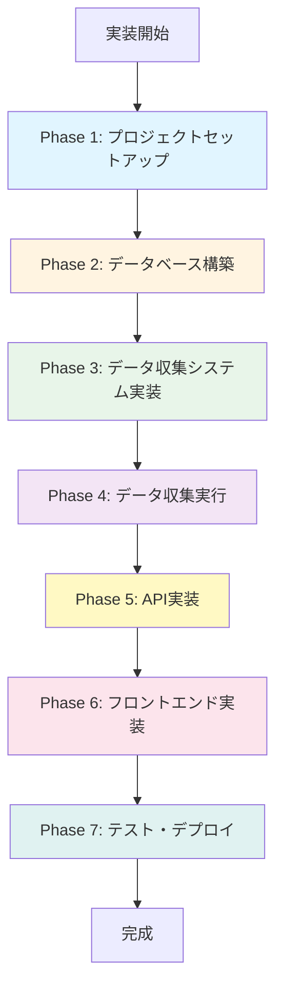

# 実装手順ガイド

本ドキュメントでは、Nomad Cafe Finderプロジェクトの実装手順を段階的に記載する。

## 目次

1. [実装の全体像](#実装の全体像)
2. [Phase 1: プロジェクトセットアップ](#phase-1-プロジェクトセットアップ)
3. [Phase 2: データベース構築](#phase-2-データベース構築)
4. [Phase 3: データ収集システム実装](#phase-3-データ収集システム実装)
5. [Phase 4: データ収集実行](#phase-4-データ収集実行)
6. [Phase 5: API実装](#phase-5-api実装)
7. [Phase 6: フロントエンド実装](#phase-6-フロントエンド実装)
8. [Phase 7: テスト・デプロイ](#phase-7-テストデプロイ)

---

## 実装の全体像



### 実装フェーズ概要

| Phase | フェーズ名 | 主な作業 | 推定時間 | 依存関係 |
|-------|-----------|---------|---------|---------|
| 1 | プロジェクトセットアップ | Next.js設定、依存関係インストール | 1-2時間 | - |
| 2 | データベース構築 | Supabaseスキーマ作成、RLS設定 | 2-3時間 | Phase 1 |
| 3 | データ収集システム実装 | グリッド検索、スクレイピング、AI統合 | 1-2日 | Phase 2 |
| 4 | データ収集実行 | 東京23区のカフェデータ収集 | 数時間〜1日 | Phase 3 |
| 5 | API実装 | カフェ検索API、エリアAPI | 1日 | Phase 2, 4 |
| 6 | フロントエンド実装 | エリア選択UI、地図UI | 2-3日 | Phase 5 |
| 7 | テスト・デプロイ | テスト、Vercelデプロイ | 1日 | Phase 6 |

**合計推定時間**: 約1週間〜2週間

---

## Phase 1: プロジェクトセットアップ

### 目標
開発環境を整備し、必要なパッケージをインストールする。

### 作業内容

#### 1.1 Next.jsプロジェクトの確認

```bash
# プロジェクトディレクトリに移動
cd nomad-cafe-finder

# 既存のプロジェクト構造を確認
ls -la
```

#### 1.2 依存関係のインストール

```bash
# パッケージマネージャーの確認（npm推奨）
npm install

# 必要なパッケージを追加インストール
npm install @supabase/supabase-js @googlemaps/js-api-loader
npm install zod  # バリデーション用
npm install date-fns  # 日付処理用
```

#### 1.3 環境変数の設定

`.env.local`ファイルを作成（既存の場合は更新）：

```env
# Google Maps/Places API
NEXT_PUBLIC_GOOGLE_MAPS_API_KEY=your_google_maps_api_key
GOOGLE_PLACES_API_KEY=your_google_places_api_key

# AI Model (いずれか1つ以上)
QWEN_API_KEY=your_qwen_api_key  # 推奨
DEEPSEEK_API_KEY=your_deepseek_api_key
GEMINI_API_KEY=your_gemini_api_key
OPENAI_API_KEY=your_openai_api_key  # 代替

# Firecrawl
FIRECRAWL_API_KEY=your_firecrawl_api_key

# Supabase
NEXT_PUBLIC_SUPABASE_URL=your_supabase_url
NEXT_PUBLIC_SUPABASE_ANON_KEY=your_supabase_anon_key
SUPABASE_SERVICE_ROLE_KEY=your_supabase_service_role_key
```

#### 1.4 開発サーバーの起動確認

```bash
npm run dev
```

http://localhost:3000 でアクセスできることを確認。

### 確認事項

- [ ] Next.jsプロジェクトが正常に起動する
- [ ] 環境変数が正しく読み込まれている
- [ ] TypeScriptのエラーがない

### 参照ドキュメント

- `README.md` - セットアップ手順

---

## Phase 2: データベース構築

### 目標
Supabaseにデータベーススキーマを作成し、テーブルとインデックスを設定する。

### 作業内容

#### 2.1 Supabaseプロジェクトの準備

1. [Supabase](https://supabase.com/)でプロジェクトを作成
2. プロジェクトのURLとAPIキーを取得
3. `.env.local`に設定（Phase 1で完了しているはず）

#### 2.2 SQLスキーマの実行

Supabaseダッシュボードの「SQL Editor」を開き、以下のSQLを順番に実行：

1. **エリアマスターテーブルの作成**

```sql
-- エリアマスターテーブル（23区管理用）
CREATE TABLE IF NOT EXISTS areas (
  code TEXT PRIMARY KEY,
  name TEXT NOT NULL,
  name_kana TEXT NOT NULL,
  bounds JSONB NOT NULL,
  center_lat DOUBLE PRECISION NOT NULL,
  center_lng DOUBLE PRECISION NOT NULL,
  cafe_count INTEGER DEFAULT 0,
  created_at TIMESTAMPTZ DEFAULT NOW(),
  updated_at TIMESTAMPTZ DEFAULT NOW()
);
```

2. **カフェマスターテーブルの作成**

```sql
-- カフェマスターテーブル（事前構築データ）
CREATE TABLE IF NOT EXISTS cafes (
  id TEXT PRIMARY KEY,
  name TEXT NOT NULL,
  name_kana TEXT,
  address TEXT NOT NULL,
  prefecture TEXT NOT NULL DEFAULT '東京都',
  city TEXT NOT NULL,
  ward_code TEXT,
  postal_code TEXT,
  lat DOUBLE PRECISION NOT NULL,
  lng DOUBLE PRECISION NOT NULL,
  
  -- ノマドワーカー向け情報
  has_wifi BOOLEAN DEFAULT FALSE,
  wifi_speed TEXT CHECK (wifi_speed IN ('fast', 'medium', 'slow', 'unknown')),
  has_power_outlets BOOLEAN DEFAULT FALSE,
  power_outlet_count TEXT CHECK (power_outlet_count IN ('many', 'few', 'none', 'unknown')),
  noise_level TEXT CHECK (noise_level IN ('quiet', 'moderate', 'noisy', 'unknown')),
  seating_types TEXT[],
  is_stay_friendly BOOLEAN DEFAULT FALSE,
  
  -- 基本情報
  opening_hours JSONB,
  rating DOUBLE PRECISION,
  user_ratings_total INTEGER DEFAULT 0,
  price_level INTEGER CHECK (price_level BETWEEN 1 AND 4),
  photos JSONB,
  website TEXT,
  phone_number TEXT,
  
  -- スコア
  nomad_score INTEGER CHECK (nomad_score BETWEEN 0 AND 100),
  nomad_score_breakdown JSONB,
  
  -- AI分析
  ai_summary TEXT,
  
  -- ソース情報
  sources JSONB NOT NULL,
  
  -- メタデータ
  data_quality_score INTEGER DEFAULT 0,
  last_verified_at TIMESTAMPTZ,
  created_at TIMESTAMPTZ DEFAULT NOW(),
  updated_at TIMESTAMPTZ DEFAULT NOW()
);
```

3. **ユーザー関連テーブルの作成**

```sql
-- ユーザープロファイル
CREATE TABLE IF NOT EXISTS profiles (
  id UUID PRIMARY KEY REFERENCES auth.users(id) ON DELETE CASCADE,
  email TEXT NOT NULL,
  display_name TEXT,
  avatar_url TEXT,
  created_at TIMESTAMPTZ DEFAULT NOW(),
  updated_at TIMESTAMPTZ DEFAULT NOW()
);

-- お気に入り
CREATE TABLE IF NOT EXISTS favorites (
  id UUID PRIMARY KEY DEFAULT gen_random_uuid(),
  user_id UUID NOT NULL REFERENCES profiles(id) ON DELETE CASCADE,
  cafe_id TEXT NOT NULL REFERENCES cafes(id) ON DELETE CASCADE,
  note TEXT,
  created_at TIMESTAMPTZ DEFAULT NOW(),
  UNIQUE(user_id, cafe_id)
);

-- 検索履歴
CREATE TABLE IF NOT EXISTS search_history (
  id UUID PRIMARY KEY DEFAULT gen_random_uuid(),
  user_id UUID REFERENCES profiles(id) ON DELETE CASCADE,
  session_id TEXT,
  location TEXT NOT NULL,
  lat DOUBLE PRECISION,
  lng DOUBLE PRECISION,
  radius INTEGER NOT NULL,
  result_count INTEGER,
  created_at TIMESTAMPTZ DEFAULT NOW()
);
```

4. **インデックスの作成**

```sql
-- エリア
CREATE INDEX IF NOT EXISTS idx_areas_code ON areas(code);

-- カフェ
CREATE INDEX IF NOT EXISTS idx_cafes_city ON cafes(city);
CREATE INDEX IF NOT EXISTS idx_cafes_ward_code ON cafes(ward_code);
CREATE INDEX IF NOT EXISTS idx_cafes_nomad_score ON cafes(nomad_score DESC);
CREATE INDEX IF NOT EXISTS idx_cafes_updated_at ON cafes(updated_at DESC);
CREATE INDEX IF NOT EXISTS idx_cafes_location ON cafes(lat, lng);
CREATE INDEX IF NOT EXISTS idx_cafes_sources ON cafes USING GIN(sources);
CREATE INDEX IF NOT EXISTS idx_cafes_data_quality ON cafes(data_quality_score DESC);

-- ユーザー関連
CREATE INDEX IF NOT EXISTS idx_favorites_user_id ON favorites(user_id);
CREATE INDEX IF NOT EXISTS idx_favorites_cafe_id ON favorites(cafe_id);
CREATE INDEX IF NOT EXISTS idx_search_history_user_id ON search_history(user_id);
CREATE INDEX IF NOT EXISTS idx_search_history_created_at ON search_history(created_at DESC);
```

5. **RLS（Row Level Security）の設定**

```sql
-- RLSを有効化
ALTER TABLE areas ENABLE ROW LEVEL SECURITY;
ALTER TABLE cafes ENABLE ROW LEVEL SECURITY;
ALTER TABLE profiles ENABLE ROW LEVEL SECURITY;
ALTER TABLE favorites ENABLE ROW LEVEL SECURITY;
ALTER TABLE search_history ENABLE ROW LEVEL SECURITY;

-- areas: 全員が閲覧可能
CREATE POLICY "Anyone can view areas" ON areas
  FOR SELECT USING (true);

-- cafes: 全員が閲覧可能（公開データ）
CREATE POLICY "Anyone can view cafes" ON cafes
  FOR SELECT USING (true);

-- profiles: 本人のみ読み書き可能
CREATE POLICY "Users can view own profile" ON profiles
  FOR SELECT USING (auth.uid() = id);

CREATE POLICY "Users can update own profile" ON profiles
  FOR UPDATE USING (auth.uid() = id);

-- favorites: 本人のみCRUD可能
CREATE POLICY "Users can view own favorites" ON favorites
  FOR SELECT USING (auth.uid() = user_id);

CREATE POLICY "Users can insert own favorites" ON favorites
  FOR INSERT WITH CHECK (auth.uid() = user_id);

CREATE POLICY "Users can delete own favorites" ON favorites
  FOR DELETE USING (auth.uid() = user_id);

-- search_history: 本人のみ閲覧可能、挿入は誰でも可能
CREATE POLICY "Users can view own search history" ON search_history
  FOR SELECT USING (auth.uid() = user_id);

CREATE POLICY "Anyone can insert search history" ON search_history
  FOR INSERT WITH CHECK (true);
```

6. **トリガーの設定**

```sql
-- updated_atの自動更新
CREATE OR REPLACE FUNCTION update_updated_at()
RETURNS TRIGGER AS $$
BEGIN
  NEW.updated_at = NOW();
  RETURN NEW;
END;
$$ LANGUAGE plpgsql;

CREATE TRIGGER areas_updated_at
  BEFORE UPDATE ON areas
  FOR EACH ROW EXECUTE FUNCTION update_updated_at();

CREATE TRIGGER cafes_updated_at
  BEFORE UPDATE ON cafes
  FOR EACH ROW EXECUTE FUNCTION update_updated_at();

CREATE TRIGGER profiles_updated_at
  BEFORE UPDATE ON profiles
  FOR EACH ROW EXECUTE FUNCTION update_updated_at();

-- エリアのカフェ数を自動更新
CREATE OR REPLACE FUNCTION update_area_cafe_count()
RETURNS TRIGGER AS $$
BEGIN
  IF TG_OP = 'INSERT' THEN
    UPDATE areas
    SET cafe_count = (
      SELECT COUNT(*) FROM cafes WHERE ward_code = NEW.ward_code
    )
    WHERE code = NEW.ward_code;
    RETURN NEW;
  ELSIF TG_OP = 'DELETE' THEN
    UPDATE areas
    SET cafe_count = (
      SELECT COUNT(*) FROM cafes WHERE ward_code = OLD.ward_code
    )
    WHERE code = OLD.ward_code;
    RETURN OLD;
  END IF;
  RETURN NULL;
END;
$$ LANGUAGE plpgsql;

CREATE TRIGGER cafes_area_count_insert
  AFTER INSERT ON cafes
  FOR EACH ROW EXECUTE FUNCTION update_area_cafe_count();

CREATE TRIGGER cafes_area_count_delete
  AFTER DELETE ON cafes
  FOR EACH ROW EXECUTE FUNCTION update_area_cafe_count();

-- 新規ユーザー登録時にprofilesレコードを自動作成
CREATE OR REPLACE FUNCTION handle_new_user()
RETURNS TRIGGER AS $$
BEGIN
  INSERT INTO profiles (id, email, display_name, avatar_url)
  VALUES (
    NEW.id,
    NEW.email,
    COALESCE(NEW.raw_user_meta_data->>'full_name', NEW.raw_user_meta_data->>'name'),
    NEW.raw_user_meta_data->>'avatar_url'
  );
  RETURN NEW;
END;
$$ LANGUAGE plpgsql SECURITY DEFINER;

CREATE TRIGGER on_auth_user_created
  AFTER INSERT ON auth.users
  FOR EACH ROW EXECUTE FUNCTION handle_new_user();
```

#### 2.3 テストデータの挿入（オプション）

エリアマスターデータを手動で挿入する場合：

```sql
-- 例: 渋谷区のデータを挿入
INSERT INTO areas (code, name, name_kana, bounds, center_lat, center_lng)
VALUES (
  'shibuya',
  '渋谷区',
  'シブヤク',
  '{"north": 35.68, "south": 35.63, "east": 139.72, "west": 139.68}'::jsonb,
  35.655,
  139.70
);
```

※ 本来は`lib/data/tokyo-wards.ts`から自動的に挿入されるため、この手動挿入は不要。

### 確認事項

- [ ] すべてのテーブルが作成されている
- [ ] インデックスが作成されている
- [ ] RLSポリシーが適用されている
- [ ] トリガーが正常に動作する（テスト挿入で確認）

### 参照ドキュメント

- `docs/DATA_MODEL.md` - データベーススキーマの詳細

---

## Phase 3: データ収集システム実装

### 目標
東京23区のカフェデータを収集するためのシステムを実装する。

### 作業内容

#### 3.1 ディレクトリ構造の作成

```bash
mkdir -p src/lib/data
mkdir -p src/lib/services
mkdir -p scripts
```

#### 3.2 東京23区データの実装

**ファイル**: `src/lib/data/tokyo-wards.ts`

このファイルは既に作成済み。内容を確認：

- [ ] `TOKYO_23_WARDS`配列が23区すべて定義されている
- [ ] 各区の`bounds`と`center`が正しく設定されている
- [ ] ユーティリティ関数（`getWardByCode`, `isPointInWard`, `getWardByLocation`）が実装されている

#### 3.3 Google Placesサービス実装

**ファイル**: `src/lib/services/google-places.ts`

```typescript
// src/lib/services/google-places.ts
import { Loader } from '@googlemaps/js-api-loader';

export class GooglePlacesService {
  private placesService: google.maps.places.PlacesService | null = null;

  async initialize() {
    const loader = new Loader({
      apiKey: process.env.NEXT_PUBLIC_GOOGLE_MAPS_API_KEY!,
      version: 'weekly',
      libraries: ['places'],
    });

    const google = await loader.load();
    const map = new google.maps.Map(document.createElement('div'));
    this.placesService = new google.maps.places.PlacesService(map);
  }

  async nearbySearch(params: {
    location: { lat: number; lng: number };
    radius: number;
    type: string;
    keyword?: string;
  }): Promise<google.maps.places.PlaceResult[]> {
    // 実装
  }

  async getPlaceDetails(placeId: string): Promise<google.maps.places.PlaceResult> {
    // 実装
  }
}
```

#### 3.4 グリッド検索サービス実装

**ファイル**: `src/lib/services/google-places-grid.ts`

```typescript
// src/lib/services/google-places-grid.ts
import { GooglePlacesService } from './google-places';

interface Bounds {
  north: number;
  south: number;
  east: number;
  west: number;
}

export class GooglePlacesGridSearch {
  private readonly GRID_SIZE = 0.0045; // 約500m（緯度）
  private readonly SEARCH_RADIUS = 500; // メートル

  constructor(private placesService: GooglePlacesService) {}

  async searchInBounds(
    bounds: Bounds,
    options: { type: string; keyword?: string }
  ): Promise<google.maps.places.PlaceResult[]> {
    // グリッド検索アルゴリズムの実装
    // 詳細は docs/DATA_COLLECTION.md の「実装詳細」セクションを参照
  }
}
```

実装コードの詳細は`docs/DATA_COLLECTION.md`の「実装詳細」セクション（184行目〜）を参照。

#### 3.5 スクレイピングサービス実装

**ファイル**: `src/lib/services/scraper.ts`

```typescript
// src/lib/services/scraper.ts
export class TabelogScraper {
  async search(name: string, address: string): Promise<TabelogData | null> {
    // Firecrawlを使用して食べログを検索・スクレイピング
  }
}

export class RettyScraper {
  async search(name: string, address: string): Promise<RettyData | null> {
    // Firecrawlを使用してRettyを検索・スクレイピング
  }
}
```

#### 3.6 AI分析サービス実装

**ファイル**: `src/lib/services/ai-service.ts`

```typescript
// src/lib/services/ai-service.ts
export class AIService {
  async analyzeNomadFriendliness(cafe: CafeData): Promise<AIAnalysis> {
    // Qwen-Flash または DeepSeek-V3.2 を使用して分析
    // Wi-Fi、電源、静かさ、座席タイプなどを判定
  }
}
```

#### 3.7 ノマドスコアサービス実装

**ファイル**: `src/lib/services/nomad-scorer.ts`

```typescript
// src/lib/services/nomad-scorer.ts
export class NomadScorer {
  calculateNomadScore(data: ScoreInput): NomadScoreBreakdown {
    // スコア算出ロジック
    // 詳細は docs/DATA_MODEL.md の「ノマドスコア算出」セクションを参照
  }
}
```

#### 3.8 データ収集スクリプト実装

**ファイル**: `scripts/collect-cafes.ts`

```typescript
// scripts/collect-cafes.ts
import { createClient } from '@supabase/supabase-js';
import { TOKYO_23_WARDS } from '../src/lib/data/tokyo-wards';
// ... その他のインポート

class CafeDataCollector {
  // 実装コード
  // 詳細は docs/DATA_COLLECTION.md の「データ収集スクリプト」セクション（252行目〜）を参照
}

// CLI実行
const collector = new CafeDataCollector(...);
collector.collectAllWards();
```

#### 3.9 package.jsonにスクリプトを追加

```json
{
  "scripts": {
    "dev": "next dev",
    "build": "next build",
    "start": "next start",
    "lint": "next lint",
    "collect:cafes": "tsx scripts/collect-cafes.ts",
    "collect:cafes:ward": "tsx scripts/collect-cafes.ts",
    "update:cafes": "tsx scripts/update-cafes.ts"
  }
}
```

`tsx`パッケージもインストール：

```bash
npm install -D tsx
```

### 確認事項

- [ ] Google Placesサービスが正常に動作する（テスト実行）
- [ ] グリッド検索が正常に動作する（1区でテスト）
- [ ] スクレイピングサービスが正常に動作する（1件でテスト）
- [ ] AI分析サービスが正常に動作する（1件でテスト）
- [ ] ノマドスコア算出が正常に動作する

### 参照ドキュメント

- `docs/DATA_COLLECTION.md` - 実装詳細コード例（184行目〜）
- `docs/DATA_MODEL.md` - ノマドスコア算出ロジック（363行目〜）

---

## Phase 4: データ収集実行

### 目標
東京23区の全カフェデータを収集し、データベースに保存する。

### 作業内容

#### 4.1 テスト実行（1区のみ）

まず1区だけで動作確認：

```bash
# 渋谷区のみ収集（テスト用）
npm run collect:cafes:ward -- --ward shibuya
```

**確認事項**:
- [ ] データが正常に収集される
- [ ] DBに正しく保存される
- [ ] エラーが発生しない
- [ ] レート制限に引っかからない

#### 4.2 全23区のデータ収集

テストが成功したら、全23区のデータを収集：

```bash
# 全23区のデータ収集（数時間かかります）
npm run collect:cafes
```

**実行時間の目安**:
- 1区あたり: 約10-20分
- 全23区: 約4-8時間

**実行中**:
- コンソールログで進捗を確認
- エラー発生時はログを確認
- 必要に応じて一時停止・再開

#### 4.3 データ品質確認

収集完了後、データの品質を確認：

```sql
-- 各区のカフェ数を確認
SELECT 
  a.name,
  a.cafe_count,
  COUNT(c.id) as actual_count
FROM areas a
LEFT JOIN cafes c ON c.ward_code = a.code
GROUP BY a.code, a.name, a.cafe_count
ORDER BY a.name;

-- データ品質スコアの分布を確認
SELECT 
  CASE 
    WHEN data_quality_score >= 80 THEN '高品質'
    WHEN data_quality_score >= 60 THEN '中品質'
    WHEN data_quality_score >= 40 THEN '低品質'
    ELSE '要改善'
  END as quality_level,
  COUNT(*) as count
FROM cafes
GROUP BY quality_level
ORDER BY 
  CASE quality_level
    WHEN '高品質' THEN 1
    WHEN '中品質' THEN 2
    WHEN '低品質' THEN 3
    ELSE 4
  END;

-- ノマドスコアの分布を確認
SELECT 
  CASE 
    WHEN nomad_score >= 80 THEN '優秀'
    WHEN nomad_score >= 60 THEN '良好'
    WHEN nomad_score >= 40 THEN '普通'
    ELSE '改善余地あり'
  END as score_level,
  COUNT(*) as count
FROM cafes
WHERE nomad_score IS NOT NULL
GROUP BY score_level
ORDER BY 
  CASE score_level
    WHEN '優秀' THEN 1
    WHEN '良好' THEN 2
    WHEN '普通' THEN 3
    ELSE 4
  END;
```

### 確認事項

- [ ] 全23区のデータが収集されている
- [ ] 各カフェの基本情報が正しく保存されている
- [ ] ノマドスコアが算出されている
- [ ] データ品質スコアが設定されている
- [ ] 重複データがない（Place IDで確認）

### 参照ドキュメント

- `docs/DATA_COLLECTION.md` - 実行方法（521行目〜）、コスト見積もり（420行目〜）

---

## Phase 5: API実装

### 目標
フロントエンドから利用するAPIエンドポイントを実装する。

### 作業内容

#### 5.1 エリアAPI実装

**ファイル**: `src/app/api/areas/route.ts`

```typescript
// src/app/api/areas/route.ts
import { NextResponse } from 'next/server';
import { createClient } from '@/lib/supabase/server';

export async function GET() {
  const supabase = createClient();
  
  const { data, error } = await supabase
    .from('areas')
    .select('*')
    .order('name');

  if (error) {
    return NextResponse.json({ error: error.message }, { status: 500 });
  }

  return NextResponse.json({ areas: data });
}
```

#### 5.2 カフェ検索API実装

**ファイル**: `src/app/api/cafes/route.ts`

```typescript
// src/app/api/cafes/route.ts
import { NextRequest, NextResponse } from 'next/server';
import { createClient } from '@/lib/supabase/server';

export async function GET(request: NextRequest) {
  const supabase = createClient();
  const { searchParams } = new URL(request.url);
  
  const ward = searchParams.get('ward');
  const bounds = searchParams.get('bounds');
  const minScore = searchParams.get('minScore');
  const hasWifi = searchParams.get('hasWifi');
  const hasPower = searchParams.get('hasPower');

  let query = supabase
    .from('cafes')
    .select('*')
    .order('nomad_score', { ascending: false });

  // フィルター適用
  if (ward) {
    query = query.eq('ward_code', ward);
  }

  if (bounds) {
    const [south, west, north, east] = bounds.split(',').map(Number);
    query = query
      .gte('lat', south)
      .lte('lat', north)
      .gte('lng', west)
      .lte('lng', east);
  }

  if (minScore) {
    query = query.gte('nomad_score', Number(minScore));
  }

  if (hasWifi === 'true') {
    query = query.eq('has_wifi', true);
  }

  if (hasPower === 'true') {
    query = query.eq('has_power_outlets', true);
  }

  const { data, error } = await query.limit(100);

  if (error) {
    return NextResponse.json({ error: error.message }, { status: 500 });
  }

  return NextResponse.json({ cafes: data || [] });
}
```

#### 5.3 カフェ詳細API実装

**ファイル**: `src/app/api/cafes/[id]/route.ts`

```typescript
// src/app/api/cafes/[id]/route.ts
import { NextRequest, NextResponse } from 'next/server';
import { createClient } from '@/lib/supabase/server';

export async function GET(
  request: NextRequest,
  { params }: { params: { id: string } }
) {
  const supabase = createClient();
  
  const { data, error } = await supabase
    .from('cafes')
    .select('*')
    .eq('id', params.id)
    .single();

  if (error) {
    return NextResponse.json({ error: error.message }, { status: 500 });
  }

  if (!data) {
    return NextResponse.json({ error: 'Not found' }, { status: 404 });
  }

  return NextResponse.json({ cafe: data });
}
```

#### 5.4 お気に入りAPI実装

**ファイル**: `src/app/api/favorites/route.ts`

```typescript
// src/app/api/favorites/route.ts
import { NextRequest, NextResponse } from 'next/server';
import { createClient } from '@/lib/supabase/server';

// GET: お気に入り一覧取得
export async function GET(request: NextRequest) {
  const supabase = createClient();
  const { data: { user } } = await supabase.auth.getUser();

  if (!user) {
    return NextResponse.json({ error: 'Unauthorized' }, { status: 401 });
  }

  const { data, error } = await supabase
    .from('favorites')
    .select(`
      *,
      cafes (*)
    `)
    .eq('user_id', user.id)
    .order('created_at', { ascending: false });

  if (error) {
    return NextResponse.json({ error: error.message }, { status: 500 });
  }

  return NextResponse.json({ favorites: data || [] });
}

// POST: お気に入り追加
export async function POST(request: NextRequest) {
  const supabase = createClient();
  const { data: { user } } = await supabase.auth.getUser();

  if (!user) {
    return NextResponse.json({ error: 'Unauthorized' }, { status: 401 });
  }

  const { cafeId, note } = await request.json();

  const { data, error } = await supabase
    .from('favorites')
    .insert({
      user_id: user.id,
      cafe_id: cafeId,
      note: note || null,
    })
    .select()
    .single();

  if (error) {
    return NextResponse.json({ error: error.message }, { status: 500 });
  }

  return NextResponse.json({ favorite: data });
}
```

**ファイル**: `src/app/api/favorites/[id]/route.ts`

```typescript
// DELETE: お気に入り削除
export async function DELETE(
  request: NextRequest,
  { params }: { params: { id: string } }
) {
  const supabase = createClient();
  const { data: { user } } = await supabase.auth.getUser();

  if (!user) {
    return NextResponse.json({ error: 'Unauthorized' }, { status: 401 });
  }

  const { error } = await supabase
    .from('favorites')
    .delete()
    .eq('id', params.id)
    .eq('user_id', user.id);

  if (error) {
    return NextResponse.json({ error: error.message }, { status: 500 });
  }

  return NextResponse.json({ success: true });
}
```

### 確認事項

- [ ] 各APIエンドポイントが正常に動作する
- [ ] エラーハンドリングが適切に実装されている
- [ ] 認証チェックが適切に実装されている（お気に入りAPI）
- [ ] レスポンス形式が統一されている

### 参照ドキュメント

- `docs/API_SPEC.md` - API仕様の詳細

---

## Phase 6: フロントエンド実装

### 目標
エリア選択UIと地図UIを実装し、ユーザーがカフェを閲覧できるようにする。

### 作業内容

#### 6.1 基本レイアウト実装

**ファイル**: `src/app/layout.tsx`

```typescript
// 基本レイアウト、ナビゲーション、認証状態の管理
```

#### 6.2 エリア選択ページ実装

**ファイル**: `src/app/page.tsx`（または `src/app/cafes/page.tsx`）

```typescript
// エリア選択UI
// - 23区の一覧表示
// - クリックでカフェ一覧ページへ遷移
```

#### 6.3 カフェ一覧ページ実装

**ファイル**: `src/app/cafes/[ward]/page.tsx`

```typescript
// 特定区のカフェ一覧表示
// - APIからカフェリストを取得
// - リスト表示
// - フィルター機能
```

#### 6.4 地図表示ページ実装

**ファイル**: `src/app/map/page.tsx`

```typescript
// Google Mapsを埋め込み
// - カフェの位置をマーカー表示
// - 地図操作で検索範囲を変更
// - マーカークリックで詳細表示
```

#### 6.5 カフェ詳細モーダル/ページ実装

**ファイル**: `src/components/cafe/CafeDetailModal.tsx`

```typescript
// カフェ詳細情報の表示
// - 基本情報
// - ノマドスコア
// - AI要約
// - お気に入り追加ボタン
```

#### 6.6 お気に入りページ実装

**ファイル**: `src/app/favorites/page.tsx`

```typescript
// お気に入りカフェの一覧表示
// - 認証チェック
// - お気に入り一覧をAPIから取得
// - 削除機能
```

#### 6.7 認証機能実装

**ファイル**: `src/components/auth/LoginButton.tsx`

```typescript
// Supabase Authを使用したログイン機能
// - Google OAuth
// - Email認証
```

### 確認事項

- [ ] エリア選択が正常に動作する
- [ ] 地図が正常に表示される
- [ ] カフェマーカーが正しく表示される
- [ ] フィルター機能が正常に動作する
- [ ] お気に入り機能が正常に動作する
- [ ] 認証機能が正常に動作する
- [ ] レスポンシブデザインが適用されている

### 参照ドキュメント

- `docs/UI_SPEC.md` - UIコンポーネントの詳細仕様

---

## Phase 7: テスト・デプロイ

### 目標
アプリケーションをテストし、本番環境にデプロイする。

### 作業内容

#### 7.1 ユニットテスト実装

**ファイル**: `src/lib/services/__tests__/nomad-scorer.test.ts`

```typescript
// ノマドスコア算出のテスト
```

#### 7.2 統合テスト実装

**ファイル**: `src/app/api/__tests__/cafes.test.ts`

```typescript
// APIエンドポイントのテスト
```

#### 7.3 E2Eテスト実装（オプション）

**ファイル**: `e2e/cafes.spec.ts`

```typescript
// Playwright等を使用したE2Eテスト
```

#### 7.4 パフォーマンステスト

- データベースクエリのパフォーマンス確認
- ページロード時間の確認
- 地図の描画パフォーマンス確認

#### 7.5 Vercelデプロイ準備

1. **環境変数の設定**

Vercelダッシュボードで環境変数を設定：
- `NEXT_PUBLIC_GOOGLE_MAPS_API_KEY`
- `GOOGLE_PLACES_API_KEY`
- `QWEN_API_KEY`（または他のAIモデル）
- `FIRECRAWL_API_KEY`
- `NEXT_PUBLIC_SUPABASE_URL`
- `NEXT_PUBLIC_SUPABASE_ANON_KEY`
- `SUPABASE_SERVICE_ROLE_KEY`

2. **デプロイ設定**

`vercel.json`（必要に応じて）:

```json
{
  "buildCommand": "npm run build",
  "devCommand": "npm run dev",
  "installCommand": "npm install",
  "framework": "nextjs"
}
```

#### 7.6 Vercelデプロイ

```bash
# Vercel CLIでデプロイ
npm install -g vercel
vercel

# 本番環境にデプロイ
vercel --prod
```

または、GitHubと連携して自動デプロイ：

1. GitHubリポジトリにプッシュ
2. VercelとGitHubを連携
3. 自動デプロイを有効化

### 確認事項

- [ ] すべてのテストが通過する
- [ ] 本番環境で正常に動作する
- [ ] 環境変数が正しく設定されている
- [ ] パフォーマンスが許容範囲内
- [ ] エラーログが適切に監視されている

### 参照ドキュメント

- `README.md` - デプロイ手順

---

## トラブルシューティング

### よくある問題と解決方法

#### 問題1: データ収集が遅い / タイムアウト

**原因**: レート制限に引っかかっている、またはAPI呼び出しが多すぎる

**解決方法**:
- `DATA_COLLECTION.md`の「エラーハンドリング」セクション（589行目〜）を参照
- 待機時間を増やす
- バッチサイズを減らす

#### 問題2: Google Places APIのエラー

**原因**: APIキーの設定ミス、クォータ超過、制限違反

**解決方法**:
- APIキーが正しく設定されているか確認
- Google Cloud Consoleでクォータを確認
- エラーメッセージを確認してリトライ

#### 問題3: Supabase接続エラー

**原因**: URL/キーの設定ミス、ネットワーク問題

**解決方法**:
- 環境変数を確認
- Supabaseダッシュボードで接続を確認
- RLSポリシーを確認

#### 問題4: AI分析が失敗する

**原因**: APIキーの設定ミス、モデルの変更

**解決方法**:
- AI APIキーを確認
- モデル名が正しいか確認
- エラーログを確認

---

## 実装チェックリスト

### Phase 1: プロジェクトセットアップ
- [ ] Next.jsプロジェクトが起動する
- [ ] 環境変数が設定されている
- [ ] TypeScriptエラーがない

### Phase 2: データベース構築
- [ ] すべてのテーブルが作成されている
- [ ] インデックスが作成されている
- [ ] RLSポリシーが適用されている
- [ ] トリガーが正常に動作する

### Phase 3: データ収集システム実装
- [ ] Google Placesサービスが動作する
- [ ] グリッド検索が動作する
- [ ] スクレイピングサービスが動作する
- [ ] AI分析サービスが動作する
- [ ] ノマドスコア算出が動作する
- [ ] データ収集スクリプトが実行可能

### Phase 4: データ収集実行
- [ ] テスト実行（1区）が成功
- [ ] 全23区のデータが収集されている
- [ ] データ品質が確認されている

### Phase 5: API実装
- [ ] エリアAPIが動作する
- [ ] カフェ検索APIが動作する
- [ ] カフェ詳細APIが動作する
- [ ] お気に入りAPIが動作する

### Phase 6: フロントエンド実装
- [ ] エリア選択UIが動作する
- [ ] 地図UIが動作する
- [ ] カフェ一覧が表示される
- [ ] フィルター機能が動作する
- [ ] お気に入り機能が動作する
- [ ] 認証機能が動作する

### Phase 7: テスト・デプロイ
- [ ] テストが通過する
- [ ] 本番環境で動作する
- [ ] パフォーマンスが許容範囲内

---

## 次のステップ

実装完了後、以下の拡張を検討：

1. **他エリアへの拡張**: 横浜、大阪など
2. **リアルタイム更新**: ユーザーからの情報提供
3. **レビュー機能**: ユーザーがカフェにレビューを投稿
4. **通知機能**: お気に入りカフェの情報更新通知
5. **統計機能**: 人気エリア、トレンドの可視化

---

## 参照ドキュメント

- [アーキテクチャ設計](./ARCHITECTURE.md) - システム全体の設計
- [技術スタック選定](./TECH_DECISIONS.md) - 採用技術の選定理由
- [データ収集戦略](./DATA_COLLECTION.md) - データ収集の詳細
- [データモデル](./DATA_MODEL.md) - データベーススキーマ
- [API仕様](./API_SPEC.md) - APIエンドポイント仕様
- [UI仕様](./UI_SPEC.md) - UIコンポーネント仕様


